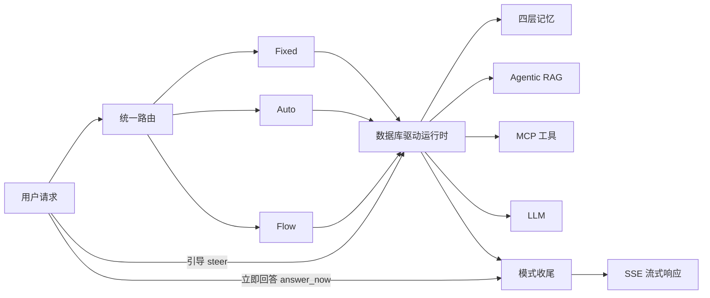

# TAgent

TAgent 是一个基于 Spring Boot、Spring AI 和 DDD 分层构建的 AI Agent 工程实践项目。项目将模型调用、Agent 编排、MCP 工具、RAG、记忆、人工审批和可观测性组合为一套可本地运行、可继续扩展的智能体平台。

本仓库是脱敏后的公开版本：不包含运行日志、临时报告、历史对话、数据库备份、浏览器状态、个人文档或真实密钥。敏感配置统一通过环境变量注入。

## 核心能力

- 三种执行模式：Fixed 直接执行、Auto 自主分析与反思、Flow 规划后按 DAG 执行。
- 运行时装配：Agent、模型、Prompt、Advisor、RAG 和 MCP 关系由数据库配置并支持热更新。
- 动态工具补充：将 MCP 工具描述写入 PgVector，根据任务语义为已选 Agent 补充工具。
- 工具约束：非执行步骤默认禁用工具，支持并行调用、串行轮次控制、重试、进度事件和结果证据。
- 四层记忆：会话记忆、工作记忆、长期记忆和情节记忆，并提供摘要、去重、冲突处理与可解释证据。
- Agentic RAG：支持查询改写、查询拆解、HyDE、向量与 BM25 混合检索、融合、rerank、父子文档和语义缓存。
- 流式干预：执行中可发送“引导”让当前步骤纳入新想法并重做，也可“立即回答”结束剩余步骤并完成收尾。
- 人机协同：高风险工具可通过 SSE 发起审批，用户批准或拒绝后继续执行。
- 可观测性：结构化日志、Prometheus 指标、Grafana 页面、Jaeger Trace、LLM 成本和 MCP 调用观测。
- 安全能力：Prompt Injection 检测、PII 脱敏、输出审核、限流、幂等和敏感工具控制。

## 技术栈

- Java 17
- Spring Boot 3.4.3
- Spring AI 1.1.7
- MyBatis、MySQL
- PostgreSQL + pgvector
- Redis
- Elasticsearch
- MCP SSE / stdio
- Resilience4j、Micrometer、Prometheus、Grafana、Jaeger

## 模块

| 模块 | 说明 |
|---|---|
| `ai-agent-station-study-api` | 对外接口、DTO 和统一响应 |
| `ai-agent-station-study-app` | 启动入口、配置、静态页面和 MyBatis 映射 |
| `ai-agent-station-study-domain` | Agent 编排、路由、执行、RAG、记忆、安全和工具逻辑 |
| `ai-agent-station-study-infrastructure` | DAO、Repository、缓存和外部存储适配 |
| `ai-agent-station-study-trigger` | HTTP Controller、任务触发和管理接口 |
| `ai-agent-station-study-types` | 通用类型、异常和任务调度组件 |
| `docs/dev-ops` | 部署文件、SQL 迁移、观测组件和 MCP 配置示例 |
| `mcp-server-hmdp` / `mcp-servers` | MCP 服务示例 |

## 执行链路



Auto、Flow、Fixed 三种模式均已接入执行干预和统一收尾：

- `steer`：保留已有进展，将用户补充的新想法加入当前步骤并重新执行，默认最多 3 轮。
- `answer_now`：停止剩余规划，基于已有中间结果进入各模式的 finalize 流程。
- 对支持关闭推理的模型，可通过 `agent.no-think.*` 注入对应请求参数。

## 准备环境

默认本地依赖：

- MySQL：`127.0.0.1:13306`
- PostgreSQL + pgvector：`127.0.0.1:15432`
- Redis：`127.0.0.1:16379`
- Elasticsearch：`127.0.0.1:9200`
- Logstash：`127.0.0.1:4560`
- Jaeger OTLP：`127.0.0.1:4318`

至少配置以下环境变量：

```bash
LLM_API_KEY=your-llm-key
EMBEDDING_API_KEY=your-embedding-key
MYSQL_PASSWORD=your-mysql-password
PGVECTOR_PASSWORD=your-postgres-password
REDIS_ADMIN_USER=your-redis-admin-user
REDIS_ADMIN_PASSWORD=your-redis-admin-password
GRAFANA_DATABASE_PASSWORD=your-grafana-database-password
LDAP_BIND_PASSWORD=your-ldap-bind-password
```

按需配置 MCP 凭据：

```bash
GITHUB_PERSONAL_ACCESS_TOKEN=your-github-token
GRAFANA_API_KEY=your-grafana-key
CSDN_API_COOKIE=your-csdn-cookie
WEIXIN_API_APP_SECRET=your-weixin-secret
```

数据库增量脚本位于 `docs/dev-ops/sql-migrations`。本次更新新增 `V037` 至 `V047`，包括父文档标题、Prompt 修正、MCP 工具目录、中文意图描述和工具向量表。

## 构建与启动

```bash
mvn "-Dmaven.test.skip=true" package
java -jar ai-agent-station-study-app/target/ai-agent-station-study-app.jar
```

默认启用 `dev` 配置，服务端口为 `8099`。

- 首页：`http://localhost:8099/index.html`
- Agent 配置：`http://localhost:8099/agent-config.html`
- 系统观测：`http://localhost:8099/observe.html`
- MCP 观测：`http://localhost:8099/observe-mcp.html`
- 健康检查：`http://localhost:8099/actuator/health`

项目包含依赖外部服务和私有账号环境的端到端测试。普通构建可跳过测试，验收时再运行对应测试类。

## 常用接口

### 流式执行

```http
POST /api/v1/agent/auto_agent
Content-Type: application/json
Accept: text/event-stream
```

```json
{
  "aiAgentId": "3",
  "message": "总结当前系统的核心能力",
  "sessionId": "session_demo_001",
  "maxStep": 5
}
```

### 引导当前执行

```http
POST /api/v1/agent/steer
Content-Type: application/json

{
  "sessionId": "session_demo_001",
  "idea": "请重点从工程落地和风险控制角度分析"
}
```

### 立即回答并收尾

```http
POST /api/v1/agent/answer_now
Content-Type: application/json

{
  "sessionId": "session_demo_001"
}
```

### 审批高风险工具

```http
POST /api/v1/agent/approval
Content-Type: application/json

{
  "approvalId": "approval-id-from-sse",
  "approved": true
}
```

## 关键配置

```yaml
agent:
  intervention:
    enabled: true
  steer:
    enabled: true
    max-rounds: 3
  answer-now:
    finalize-tools: true
  mcp:
    disable-tools-on-nonexec-steps: true
    tool-call:
      parallel-enabled: true
      max-serial-rounds-per-client: 3
  dynamic-tools:
    infer-on-selected-agent: true
    per-need-top-k: 2
    max-extra-tools-per-request: 6
```

## 安全说明

提交前请确认仓库中不包含真实 API Key、Access Token、Cookie、私钥、运行日志、个人对话、压测报告和数据库备份。公开配置应始终使用环境变量占位符。

更新记录见 [CHANGELOG.md](CHANGELOG.md)。
