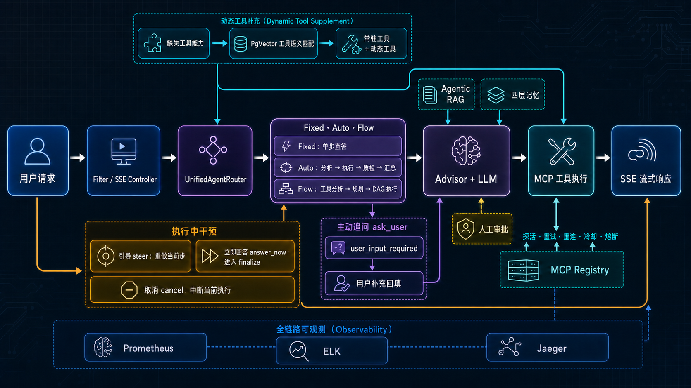

# TAgent

🚀 **A Production-Grade AI Agent Engineering Framework**

[](https://opensource.org/licenses/MIT)
[](https://www.oracle.com/java/)
[](https://spring.io/projects/spring-boot)
[](https://github.com/pengmoubuaixuexi/TAgent/actions/workflows/ci.yml)
[](https://github.com/pengmoubuaixuexi/TAgent)

[中文文档](./README.md) | **English**

TAgent is an enterprise-level AI Agent implementation project built on **Java 17**, **Spring Boot**, **Spring AI**, and **Domain-Driven Design (DDD)** layered architecture.

Unlike simple model wrapper, TAgent covers the **complete end-to-end lifecycle** of an Agent request: from ingestion, routing, runtime assembly, planning & execution, RAG, memory management, MCP tool governance, human approval, in-execution intervention, to SSE streaming output and full-chain observability.

*This repository is a sanitized public version without real API keys, runtime logs, chat histories, temporary reports, database backups, or personal data.*

### Who Is This For?

- Developers learning **Java / Spring AI Agent engineering** beyond a simple model wrapper.
- Builders exploring **MCP tool governance, dynamic tool attachment, Agentic RAG, and multi-layer memory**.
- Teams looking for a reference implementation of **SSE streaming, human approval, in-execution intervention, proactive `ask_user` clarification, and observability**.

---

## 🎯 System Overview



### Main Request Flow

```text
User Request
  -> Filter / SSE Controller
  -> UnifiedAgentRouter
  -> Fixed / Auto / Flow
  -> Advisor + LLM
  -> MCP Tool Execution
  -> SSE Streaming Response
```

### Key Control Flows Beyond Main Chain

- **Dynamic Tool Supplement**: Router detects missing capabilities → PgVector matches real MCP tools from catalog → merge with Agent's resident tools
- **In-Execution Intervention**: Users can send `steer` to redo current step, `answer_now` to skip remaining steps, or `cancel` to abort
- **Proactive Clarification**: Model can invoke `ask_user` to collect missing information via SSE, then continue execution with user input

---

## ✨ Key Capabilities

| Capability | Implementation |
|---|---|
| **Three Agent Modes** | Fixed (single-step Q&A), Auto (analyze-execute loop), Flow (DAG orchestration) |
| **Database-Driven Assembly** | Agent, Client, Model, Prompt, Advisor, RAG, MCP relationships configured via DB |
| **Unified Agent Router** | Single LLM call to select Agent and infer missing tool capabilities |
| **Dynamic MCP Tools** | Tool catalog localization, intent expansion, PgVector semantic matching, on-demand attachment |
| **MCP Self-Healing** | Lazy probing, failure retry, timeout reconnect, dead-client rebuild, cooldown & circuit breaker |
| **Tool Governance** | Disable tools in non-execution steps, correct unknown tools, parameter hints, round budget, parallel execution |
| **Agentic RAG** | Four query strategies: SIMPLE, HyDE, FUSION, DECOMPOSE |
| **Four-Layer Memory** | Working, Chat, Long-Term, Episodic Memory |
| **Streaming Intervention** | Auto/Flow/Fixed support immediate answer, steering, or cancellation |
| **Proactive Q&A** | `ask_user` requests supplementary info via SSE (disabled by default, per-session limit & timeout) |
| **Human-in-the-Loop** | High-risk tool calls request manual approval/rejection via SSE |
| **Explainable Output** | Tool progress, RAG evidence, Memory evidence, step status |
| **Full-Chain Observability** | Prometheus, ELK, Jaeger, event_log, LLM cost & MCP health dashboard |

---

## 🔄 End-to-End Request Flow

### 1. Ingestion & SSE Connection

Request enters `POST /api/v1/agent/auto_agent` through:

1. `MdcTraceFilter`: Inject context (request, trace, user, tenant, session)
2. `RateLimitFilter`: Rate limiting by user/session/IP
3. `IdempotencyFilter`: Idempotency support for sync requests
4. `AiAgentController`: Create `ResponseBodyEmitter`, register approval channel, send `ack`
5. Dispatch async execution via `ExecuteCommandEntity`

The `ack` includes intervention capability flags for frontend UI rendering.

### 2. Unified Router & Lazy Assembly

`AgentDispatchService` handles:

- Select best `agent_id` via `UnifiedAgentRouter` (if user doesn't specify)
- Infer missing tool capabilities even if Agent is pre-selected
- Return `missing_tool_descs` for dynamic tool attachment
- Lazy-load ChatClient, Model, Advisor, MCP callback on first use via Armory
- Dispatch to Fixed, Auto, or Flow strategy based on `agent.strategy`

Assembly relationships sourced from:
- `ai_agent`, `ai_client`, `ai_client_model`, `ai_client_api`
- `ai_client_system_prompt`, `ai_client_advisor`, `ai_client_tool_mcp`, `ai_client_rag_order`

DB config is cached in Beans after Armory assembly. Recommend re-assembly or restart after updating core model/prompt/tool relationships.

### 3. Three Execution Modes

#### Fixed Mode
Direct Q&A or single-turn tool task:
```text
Prepare Context -> Inject Advisor -> Merge Tools -> LLM Stream -> Save Memory -> Output
```
Also supports MCP calls, RAG, long-term memory, `steer` re-generation, and `answer_now` early exit.

#### Auto Mode
Self-driven analysis, execution, and verification loop:

| Step | Responsibility | Tool Enabled |
|---|---|---|
| Step1 | Analyze task, judge completion | ❌ |
| Step2 | Execute specific task | ✅ |
| Step3 | Quality check & Reflexion | ❌ |
| Step4 | Summarize final result | ❌ |

Loops until task complete or `maxStep` reached. Step3 can return structured critique to refine Step2.

#### Flow Mode
Decompose complex tasks into dependency-aware steps:

| Step | Responsibility | Tool Enabled |
|---|---|---|
| Step1 | Analyze required tool capabilities | ❌ |
| Step2 | Generate step plan with `DEPENDS_ON` | ❌ |
| Step3 | Parse plan into DAG | - |
| Step4 | Execute in parallel respecting dependencies | ✅ |

Parallel boundaries:
- Steps with satisfied dependencies can run concurrently
- Tools from different MCP servers can parallelize
- Same MCP server reuses connection → serial execution to avoid transport layer concurrency issues

---

## 🛠️ Dynamic MCP Tool Supplement

Instead of loading all tools upfront (increases context, tool hallucination, wrong tool selection), TAgent separates "resident tools" and "on-demand dynamic tools".

```text
UnifiedAgentRouter
  -> missing_tool_descs
  -> Generate embedding per capability
  -> PgVector query mcp_tool_vector
  -> Top-K per capability
  -> Relative distance threshold filter
  -> Union & deduplicate results
  -> Lazy-create or reuse MCP callback
  -> Resident tools + Dynamic tools
  -> Inject into request
```

Tool assets:
- MySQL `ai_mcp_tool_catalog`: Real tool name, MCP, original desc, Chinese desc, Chinese intent
- PgVector `mcp_tool_vector`: Embedding for semantic retrieval

Current matching uses embedding-only (no BM25 or LLM rerank fallback). When vector service is unavailable, skip dynamic attachment rather than force bad matches.

---

## 🔧 MCP Tool Governance & Auto-Reconnect

Tool calls go through `MeteredToolCallback`, `RobustToolCallingManager`, and `McpClientRegistry` three-layer governance.

### McpClientRegistry

Maintains MCP Client, tool-MCP mapping, rebuild factory, last-success time, consecutive failures, and circuit state.

Self-healing paths:
1. Lazy probing before tool calls
2. Limited retry on first failure
3. Timeout re-probe to check if connection is truly dead
4. Rebuild MCP Client on dead-client or send failure
5. After rebuild, refresh old `MeteredToolCallback` internal delegate
6. 10-second cooldown per MCP to avoid retry storms
7. Circuit open when consecutive failures accumulate

Reconnected state keeps `ToolDefinition` stable to frontend, so parameter hints don't disappear on callback switch.

### MeteredToolCallback

Each tool call handles:
- Input normalization & parameter constraint hints
- First-failure, retry, recovery, final-failure stats
- Timeout probing & reconnection
- High-risk tool approval
- Result cleansing & length truncation
- `tool_call_start`/`tool_call_end`/`tool_call_error` SSE events
- Process-level send lock per MCP Server

### RobustToolCallingManager

Tool loop layer handles:
- Hide real tools schema in non-execution steps
- Tool name case correction
- Unknown tool returns available tools list for self-correction
- Single Client serial round limit
- Same-round different MCP parallelization
- Response reorder & merge

### MCP Observability

Visit `http://localhost:8099/observe-mcp.html` to view:
- Client state: `alive`, `dead`, `reconnect_cooldown`, `circuit_open`
- Recent success/probe/reconnect timestamps
- First-failure, recovery, retry, reconnect-failure, cooldown-hit counters
- Tool call count, latency, error rate, recent error samples

---

## 📚 Advisor Chain

Advisors are DB-configured and participate in request chain by `order`:

| Advisor | Purpose |
|---|---|
| Semantic Cache | Short-circuit if similar question cached |
| Long-Term Memory | Inject user profile & semantic memory; async extract post-response |
| Episodic Memory | Inject current or cross-session summaries |
| Prompt Injection | Detect potential prompt injection attacks |
| PII Mask | Redact sensitive info in input/output |
| Agentic RAG | Decide whether to retrieve; select query strategy |
| Rag Answer | Execute hybrid retrieval, rerank, parent-doc swap, cite assembly |
| Chat Memory | Read-only history context; full response written by application layer |
| CoVe | Retrieve-augmented verification & observability on response claims |

Custom Advisors preserve request options during Prompt rebuild to avoid losing dynamic tools, maxTokens, toolContext.

---

## 🧠 Agentic RAG

RAG Router first decides whether retrieval is needed, then selects from four strategies:

| Strategy | Description |
|---|---|
| SIMPLE | Rewrite original query, then retrieve |
| HYDE | Generate hypothetical document first, then retrieve by its embedding |
| FUSION | Generate multiple query variants, fuse results with RRF |
| DECOMPOSE | Decompose multi-hop question into parallel sub-queries |

Retrieval pipeline:
```text
Query Planning
  -> PgVector semantic recall
  -> Elasticsearch BM25
  -> RRF fusion
  -> Cross Encoder / LLM Rerank
  -> Child hit swap to Parent Document
  -> Inject numbered citations
  -> rag_evidence SSE
```

Dynamic tool matching and RAG document retrieval are separate pipelines:
- Dynamic tools: PgVector embedding-only
- RAG documents: PgVector + BM25 + RRF + rerank

---

## 💾 Four-Layer Memory

| Memory Layer | Storage | Purpose |
|---|---|---|
| Working Memory | Redis | Save Auto/Flow step intermediates; support inter-step reads & post-disconnect completion replay |
| Chat Memory | MySQL + Redis Cache | Multi-turn chat history & rolling summarization |
| Long-Term Memory | MySQL Meta + PgVector | User profile, skills, preferences, plans, context; semantic recall |
| Episodic Memory | MySQL | Session-phase summaries and recent experiences |

Long-Term Memory includes:
- Fixed profile slots
- Episodic memory semantic recall
- Exact-match & semantic dedup
- Single-value override & cumulative merge
- Conflict detection
- Access hotness inheritance & cold-memory archival
- Single-round multi-step recall snapshot sharing

When RAG or memory truly retrieves content, frontend gets `rag_evidence` or `memory_evidence` SSE event.

---

## 🎮 In-Execution Intervention

All three modes (Auto, Flow, Fixed) support `steer`, `answer_now`, and `cancel`. Frontend button toggles to cancel state; steering reuses main input box, no separate popup.

### Steering (steer)

```http
POST /api/v1/agent/steer
Content-Type: application/json

{
  "sessionId": "session_demo_001",
  "idea": "Focus on engineering feasibility and risk control"
}
```

Behavior:
- Interrupt current stream (don't wait for natural step end)
- Keep current reasoning, half-streamed output, prior step results
- Merge new idea into effective user query
- Re-do current step, carry steering to subsequent steps
- `agent.steer.max-rounds` limits re-do cycles per step

Flow in Step4 DAG ignores new steer to avoid cutting off launched parallel tasks.

### Immediate Answer (answer_now)

```http
POST /api/v1/agent/answer_now
Content-Type: application/json

{
  "sessionId": "session_demo_001"
}
```

Behavior:
- Interrupt current stream
- Skip remaining analysis/planning steps
- Finalize based on intermediate results & half-streamed output
- Keep necessary tools for final fact checks
- Inject no-thinking param for models supporting reasoning shutdown
- Normal memory save (Chat, Long-Term, Episodic)

Finalize steps:
- Auto: `step4_answer_now`
- Flow: `flow_step4_answer_now`
- Fixed: `fixed_answer_now`

### Cancel Execution (cancel)

```http
POST /api/v1/agent/cancel
Content-Type: application/json

{
  "sessionId": "session_demo_001"
}
```

Behavior:
- Broadcast cancel signal to Fixed, Auto, Flow strategies
- In-flight LLM stream terminates quickly via cancel trigger
- Cancelled execution skips remaining steps & finalize
- Frontend aborts local fetch after `/cancel` call to sync backend state

---

## 🤔 Proactive Clarification (ask_user)

When model lacks critical info or user intent has multiple valid interpretations, invoke `ask_user` to proactively request clarification.

Flow:
```text
Advisor + LLM
  -> ask_user tool_call
  -> user_input_required SSE
  -> User provides supplementary input
  -> ask_user tool result
  -> Continue next reasoning round
```

Design boundaries:
- `agent.user-input.enabled=false` completely suppresses `ask_user` broadcast (default preserves original flow)
- `UserInputGate` limits asks per `sessionId` & supports auto-release on timeout
- `ask_user` and human approval use separate ID channels (approval gates tool usage, ask_user gates requirement clarification)
- V048 migration limits `ask_user` to analysis steps only, preventing non-execution steps from wrongly calling real tools

---

## 👨‍💼 Human Approval

High-risk tools can be configured to require pre-execution approval:

1. Backend sends `human_approval_required` SSE event
2. Frontend displays tool name, parameters, approval reason
3. User calls approval endpoint
4. Approve → execute; reject/timeout → return structured error to model

```http
POST /api/v1/agent/approval
Content-Type: application/json

{
  "approvalId": "approval-id-from-sse",
  "approved": true
}
```

---

## 📡 SSE Events

| Event | Purpose |
|---|---|
| `ack` | Confirm connection & return intervention flags |
| `step_start` / `step_end` | Show Agent's current step |
| `token` | Stream token for real-time rendering |
| `tool_call_start` / `tool_call_end` / `tool_call_error` | Show tool progress |
| `human_approval_required` | Request manual tool approval |
| `user_input_required` | Model requests supplementary info via `ask_user` |
| `rag_evidence` | Show knowledge base citation basis |
| `memory_evidence` | Show memory recall basis |
| `data` | Return step result or final result |

---

## 📊 Observability

TAgent records model, tool, and Agent step metrics:

- `LlmObservationRecorder`: Model, latency, tokens, cache tokens, billing scope
- `ai_event_log`: Step input/output, routing, tools, intervention, final result
- Prometheus: LLM & MCP metrics
- ELK: Structured logs & MDC context
- Jaeger: Cross-service trace (Controller → Step → LLM → Tool)
- `WireTraceRecorder`: Stream wire info without consuming response body

Dashboard pages:
- System Observability: `http://localhost:8099/observe.html`
- MCP Observability: `http://localhost:8099/observe-mcp.html`

---

## 📋 Tech Stack

- **Java 17**
- **Spring Boot 3.4.3**
- **Spring AI 1.1.7**
- **MCP SDK 0.18.2**
- **MyBatis, MySQL**
- **PostgreSQL + pgvector**
- **Redis**
- **Elasticsearch**
- **Resilience4j**
- **Reactor, SSE**
- **Micrometer, Prometheus, Grafana, Jaeger, ELK**

---

## 🏗️ Project Modules

| Module | Description |
|---|---|
| `ai-agent-station-study-api` | Interfaces, DTOs, unified response |
| `ai-agent-station-study-app` | Spring Boot starter, config, static pages, MyBatis XML |
| `ai-agent-station-study-domain` | Agent router, execution strategies, RAG, memory, MCP, security governance |
| `ai-agent-station-study-infrastructure` | DAO, Repository, cache, external storage adapter |
| `ai-agent-station-study-trigger` | HTTP Controller, admin interface, task trigger |
| `ai-agent-station-study-types` | Common types, exceptions, scheduling components |
| `docs/dev-ops` | Docker, SQL migrations, Grafana, Prometheus, MCP config |
| `mcp-server-hmdp` / `mcp-servers` | MCP Server examples |

---

## 🚀 Quick Start

### Prerequisites

Default addresses:

| Service | Address |
|---|---|
| MySQL | `127.0.0.1:13306` |
| PostgreSQL + pgvector | `127.0.0.1:15432` |
| Redis | `127.0.0.1:16379` |
| Elasticsearch | `127.0.0.1:9200` |
| Logstash | `127.0.0.1:4560` |
| Jaeger OTLP | `127.0.0.1:4318` |

### Environment Variables

```bash
# LLM Configuration
LLM_BASE_URL=https://your-openai-compatible-endpoint
LLM_API_KEY=your-llm-key
LLM_MODEL=your-model

# Embedding Configuration
EMBEDDING_BASE_URL=https://your-embedding-endpoint
EMBEDDING_API_KEY=your-embedding-key
EMBEDDING_MODEL=BAAI/bge-m3

# Database Credentials
MYSQL_USERNAME=root
MYSQL_PASSWORD=your-mysql-password
PGVECTOR_USERNAME=postgres
PGVECTOR_PASSWORD=your-postgres-password
```

Optional MCP and observability credentials:

```bash
GITHUB_PERSONAL_ACCESS_TOKEN=your-github-token
GRAFANA_API_KEY=your-grafana-key
CSDN_API_COOKIE=your-csdn-cookie
WEIXIN_API_APP_SECRET=your-weixin-secret
```

### Database Migration

Incremental scripts located in:

```text
docs/dev-ops/sql-migrations
```

Execute in version order for new environment. Dynamic tool features require at least `V041`, `V046`, `V047`.

### Build

```bash
mvn "-Dmaven.test.skip=true" package
```

Project includes integration tests dependent on external services. Skip tests for local build, run specific test classes during acceptance testing.

### Run

```bash
java -jar ai-agent-station-study-app/target/ai-agent-station-study-app.jar
```

Default port: `8099`

- Chat UI: `http://localhost:8099/index.html`
- Agent Config: `http://localhost:8099/agent-config.html`
- Health Check: `http://localhost:8099/actuator/health`

---

## 📤 Example Streaming Request

```http
POST /api/v1/agent/auto_agent
Content-Type: application/json
Accept: text/event-stream
```

```json
{
  "aiAgentId": "3",
  "message": "Summarize current system's Agent, RAG, memory, and MCP capabilities",
  "sessionId": "session_demo_001",
  "userId": "user_demo",
  "maxStep": 5
}
```

---

## ⚙️ Key Configuration

```yaml
agent:
  intervention:
    enabled: true
  steer:
    enabled: true
    max-rounds: 3
  answer-now:
    finalize-tools: true
  user-input:
    enabled: false
    max-asks: 2
    timeout-seconds: 120

  mcp:
    disable-tools-on-nonexec-steps: true
    tool-call:
      max-attempts: 2
      retry-delay-ms: 1000
      parallel-enabled: true
      max-serial-rounds-per-client: 3

  dynamic-tools:
    infer-on-selected-agent: true
    per-need-top-k: 2
    max-extra-tools-per-request: 6
    match-cache-ttl-ms: 600000
```

---

## 🔒 Security Notice

Do not commit to public repository:

- API Keys, Access Tokens, Cookies, Private Keys
- `.local-config`, browser state, local credentials
- Runtime logs, load test reports, temporary debug files
- Personal conversations, resumes, interview materials
- Database backups and production data

---

## 📝 Changelog

See [CHANGELOG.md](CHANGELOG.md) for update history.

---

## 📄 License

This project is licensed under the [MIT License](LICENSE).

---

**Questions or Ideas?** Open an issue or discussion! We welcome contributions and feedback. 🙌
